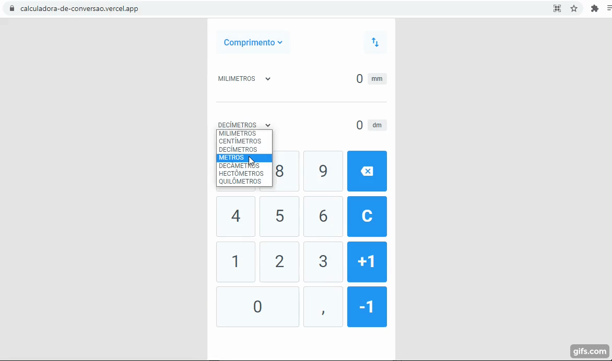

<h1 align="center">
    
</h1>

<h1>
    
</h1>

<h1 align="center">
    <a href="https://calculadora-de-conversao.vercel.app/">🔗Acessar a desmonstração</a>
</h1>

## 📄 Sobre

O projeto é uma calculadora de conversão de medidas onde é possível inserir um valor e converte-lo de uma unidade de medida selecionada a outra unidade de medida também selecionada.

Exemplo: Converter 83 centímetros para metros obtendo 0.83 metros.

---

## 🚀 Tecnologias utilizadas

O projeto foi desenvolvido utilizando as seguintes tecnologias:

- Html e Css
- JavaScript

---

<h4 align="center"> 
	🚧  JavaScript 🚀 Em construção...  🚧
</h4>

---

Desenvolvido por Carlos Gabriel Leite Barros.